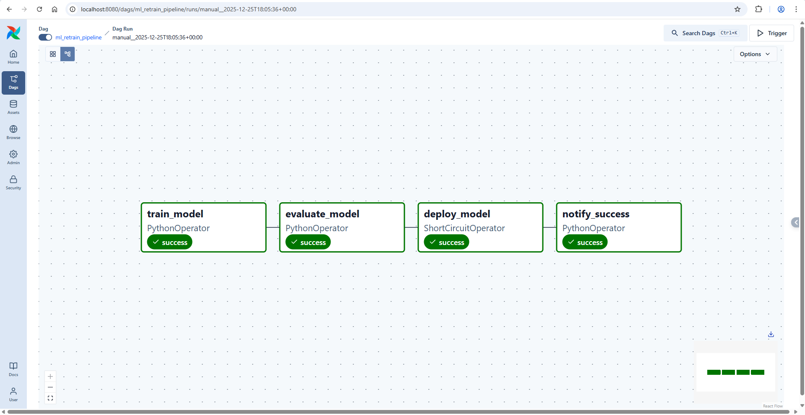
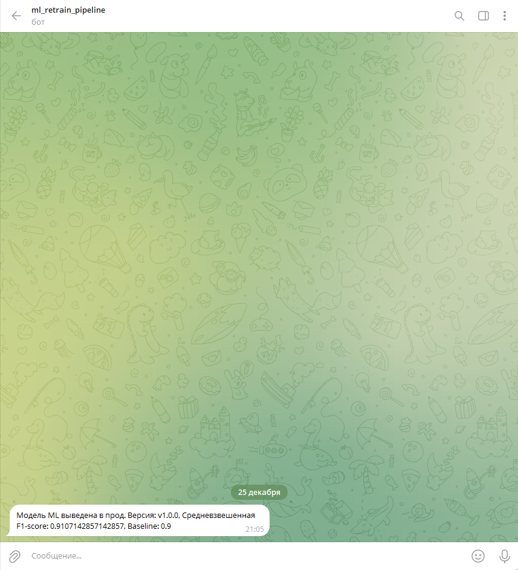

# HW5. Модификация DAG в Airflow для уведомлений о выводе новой модели в продакшн
Автор: Можогин Сергей Сергеевич, Науки о данных, 25.12.2025

**Ссылка на контейнеризированное REST-API приложение с обученной моделью в Yandex Cloud Serverless Containers:**
https://bbab71hf3qrnrlpk6gfe.containers.yandexcloud.net/docs

## Описание проекта
В проекте реализован автоматизированный ML-пайплайн переобучения модели с использованием **Apache Airflow**. **DAG** включает этапы обучения, оценки качества и деплоя модели в цикле **CI/CD** в **Yandex Cloud Serverless Containers** при превышении метрики средневзвешенной **F1-score** в **0.9**. Параметры инфраструктуры задаются в конфигурации **Terraform**. Версия модели передается через переменные окружения и используется в логике пайплайна. После успешного деплоя отправляется уведомление в **Telegram**. Скриншоты приложены ниже.

## Скриншоты
Скриншот графа **Apache Airflow**:

Скриншот уведомления в **Telegram**:
